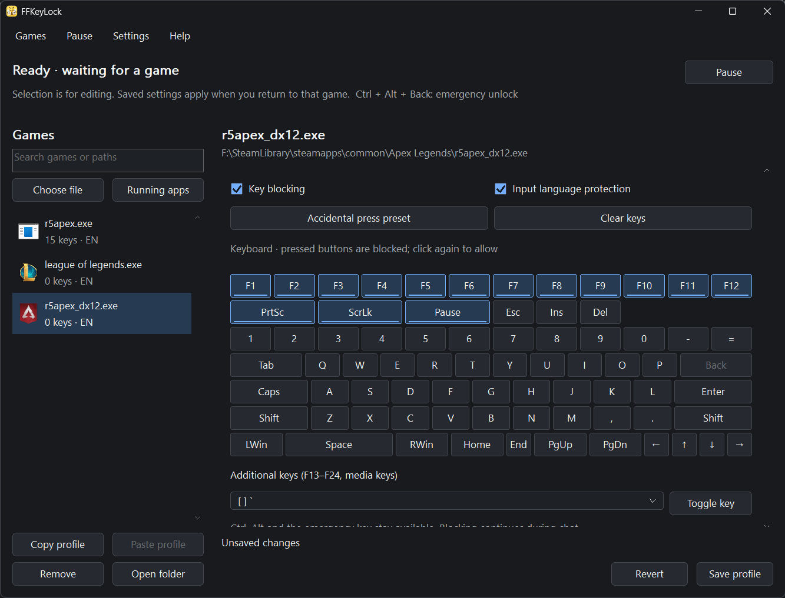

# FFKeyLock

A lightweight Windows utility that prevents accidental key presses in games. Set key-blocking and input-language preferences for each game; its saved profile applies when the game is in front and releases when you switch away.

[简体中文](README.zh-CN.md) · [Download](https://github.com/brealinxx/FFKeyLock/releases/latest) · [Changelog](CHANGELOG-en.md)



## Quick start

1. Download the installer or ZIP for your PC and run FFKeyLock (Windows 10 / 11; x64, x86 or ARM64).
2. Choose **Choose file** or **Running apps** to add the actual game executable, rather than its launcher.
3. Apply **Accidental press preset**, then click any keys you need to allow. Turn off **Input language protection** if you only want key blocking.
4. Select **Save profile** and return to the game. Closing the main window keeps FFKeyLock in the tray; use the menu to exit.

**Emergency unlock: `Ctrl + Alt + Backspace`.** Settings also offers `Ctrl + Alt + End / Home`. Resume manually after an emergency unlock. Ordinary pauses can last 30 seconds, 5 minutes, or until you resume.

## Features

- **Per-game key blocking:** the preset covers F1–F12, PrtSc, Scroll Lock and Pause / Break, with individual exceptions and additional function/media keys.
- **Independent input-language protection:** configure it separately from key blocking. Chat can release input-language control while selected keys remain blocked.
- **Easy profile management:** search, copy/paste and import/export; full paths distinguish games with the same executable name.
- **Tray controls:** configurable pause, startup and notifications; Chinese/English, light/dark themes and keyboard navigation.
- **Consistent themed panels:** rounded, subtle borders around the library and editor; matching scroll tracks with distinct hover and drag states, plus wheel and keyboard scrolling. Dropdown scrollbars also retain their theme while scrolling.
- **Native and lightweight:** C++20 / Win32, with no browser runtime, managed framework, background service, driver or code injected into games.

Selecting a game edits its profile; protection follows the foreground game. Changes apply after saving, and theme changes retain your draft. The separate global Windows-key policy can optionally block it on the desktop as well.

## Configuration and compatibility

The installed edition saves settings to `%APPDATA%\FFKeyLock\config.ini`; upgrades preserve existing settings and language. ZIP packages include an empty-library `portable.ini` and save settings beside the executable. When updating a portable copy, keep your own `portable.ini` instead of overwriting it with the packaged template. Create `portable.ini` beside the executable, or use `--config "C:\path\config.ini"`, for isolated settings. `--background` starts directly in the tray.

Migration preserves a `.v1.bak` copy; invalid configuration is preserved as `.invalid.bak` before a later save. Import merges game profiles while retaining global settings. An intentionally empty library stays empty.

The key test near the top of the editor checks the current draft and works only while FFKeyLock is in front. Games with anti-cheat, special input paths or elevated privileges require real-game verification; the local test does not guarantee compatibility. Ctrl, Alt and the emergency key remain available.

## Build and test

Develop on `dev`; after verification, commit to `dev`, merge into `main`, push both branches when authorized, and return to `dev`.

Requires Visual Studio C++ toolset **v145**, Windows SDK 10.0 and MSBuild. Open `FFKeyLock.slnx`, or run:

```powershell
MSBuild.exe FFKeyLock.slnx /p:Configuration=Release /p:Platform=x64 /m
MSBuild.exe tests/FFKeyLock.Tests.vcxproj /p:Configuration=Release /p:Platform=x64 /m
tests/artifacts/x64/FFKeyLock.Tests.exe tests/artifacts
```

The x64 executable is written to `x64/Release/FFKeyLock.exe`. Use `Platform=Win32` or `ARM64` for other architectures with the corresponding tools installed. Tests support x64 / Win32.

<details>
<summary>Build an installer</summary>

Install Inno Setup and build the matching architecture first:

```powershell
ISCC.exe /DAppArchitecture=x64 installer/FFKeyLock.iss
```

Run `powershell -File scripts/Test-ReleaseVersion.ps1` before packaging to validate versions. Build a portable ZIP in `dist/` with `powershell -File scripts/New-PortablePackage.ps1 -Architecture x64`.

Supported architecture arguments: `x64`, `x86`, `arm64`. Output: `installer/output/`.

</details>

See [verification results and limits](tests/VERIFICATION.md), [maintenance instructions](AGENTS.md) and the [UI architecture guide](FFKeyLock/UI/README.md).

[MIT License](LICENSE)
