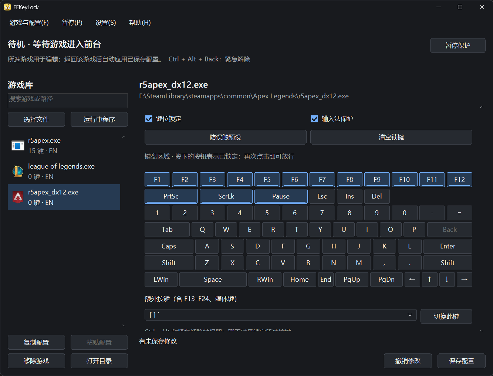

# FFKeyLock

轻量的 Windows 游戏防误触工具。为每个游戏设置锁键和输入法策略，进入游戏自动应用，切回桌面自动解除游戏专属保护。

[English](README.md) · [下载最新版](https://github.com/brealinxx/FFKeyLock/releases/latest) · [更新日志](CHANGELOG.md)



## 快速开始

1. 下载适合电脑的安装包或 ZIP，运行 FFKeyLock（支持 Windows 10 / 11，x64、x86、ARM64）。
2. 点击“选择文件”或“运行中程序”，添加真正的游戏程序，而非启动器。
3. 点击“防误触预设”，再点击游戏需要使用的键将其放行；只需锁键时关闭“输入法保护”。
4. 点击“保存配置”，返回游戏后自动生效。关闭主窗口会留在托盘，需要退出时使用菜单。

**紧急解除：`Ctrl + Alt + Backspace`。** 也可在设置中改为 `Ctrl + Alt + End / Home`。紧急解除后需手动恢复保护；普通暂停可选择 30 秒、5 分钟或直到手动恢复。

## 能做什么

- **逐游戏防误触**：预设锁定 F1–F12、PrtSc、Scroll Lock、Pause / Break；可逐键调整，支持额外功能键与媒体键。
- **独立输入法保护**：锁键与输入法分别开关；支持游戏聊天时释放输入法控制，同时继续锁键。
- **方便管理**：搜索游戏、复制粘贴配置、导入导出；按完整路径区分同名程序。
- **托盘常驻**：暂停、恢复、开机启动和通知均可配置；支持中英文、深浅主题与键盘导航。
- **统一主题界面**：游戏列表与配置区使用圆角细边框；滚动轨道跟随面板背景，滑块悬停和拖动时增强对比，支持滚轮及键盘滚动；下拉列表滚动时也保持主题外观。
- **原生轻量**：C++20 / Win32，无浏览器运行时、托管框架、后台服务或驱动，不向游戏注入代码。

列表选择的是编辑对象，保护跟随前台游戏。未保存修改不会自动生效；主题切换保留草稿。全局 Win 键策略可单独设为始终锁定，启用该范围后也会影响桌面。

## 配置与兼容性

安装版默认配置保存在 `%APPDATA%\FFKeyLock\config.ini`，升级保留已有配置和显示语言。ZIP 便携包自带空游戏库的 `portable.ini`，配置直接保存在解压目录；更新便携版时保留自己的 `portable.ini`，不要用包内模板覆盖。在程序旁创建 `portable.ini`，或使用 `--config "C:\path\config.ini"`，即可使用独立配置；`--background` 直接进入托盘。

旧配置迁移前保留 `.v1.bak`；无效配置在后续保存前保留 `.invalid.bak`。导入仅合并游戏配置，不覆盖当前全局设置；清空游戏库后不会自动补回默认条目。

编辑器上方的“测试配置”可测试当前草稿，只在 FFKeyLock 前台有效。带反作弊、特殊输入方式或更高权限的游戏仍需实测；本地测试通过不代表所有游戏兼容。Ctrl、Alt 和紧急解除键始终保留。

## 开发与验证

优先在 `dev` 分支开发；验证后提交 `dev`、合并到 `main`，再按授权推送两个分支，最后切回 `dev`。

需要 Visual Studio C++ 工具集 **v145**、Windows SDK 10.0 和 MSBuild。打开 `FFKeyLock.slnx`，或运行：

```powershell
MSBuild.exe FFKeyLock.slnx /p:Configuration=Release /p:Platform=x64 /m
MSBuild.exe tests/FFKeyLock.Tests.vcxproj /p:Configuration=Release /p:Platform=x64 /m
tests/artifacts/x64/FFKeyLock.Tests.exe tests/artifacts
```

x64 程序输出到 `x64/Release/FFKeyLock.exe`。其他架构使用 `Platform=Win32` 或 `ARM64`（需要对应工具）；测试支持 x64 / Win32。

<details>
<summary>安装包构建</summary>

安装 Inno Setup 并先构建对应架构，再运行：

```powershell
ISCC.exe /DAppArchitecture=x64 installer/FFKeyLock.iss
```

打包前运行 `powershell -File scripts/Test-ReleaseVersion.ps1` 校验版本；便携 ZIP 使用 `powershell -File scripts/New-PortablePackage.ps1 -Architecture x64` 生成到 `dist/`。

架构可选 `x64`、`x86`、`arm64`，产物位于 `installer/output/`。

</details>

详细记录与实测边界见 [验证记录](tests/VERIFICATION.md)；维护入口见 [AGENTS.md](AGENTS.md) 与 [UI 结构说明](FFKeyLock/UI/README.md)。

[MIT License](LICENSE)
